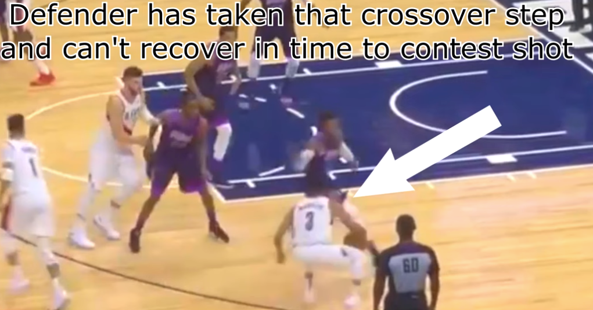
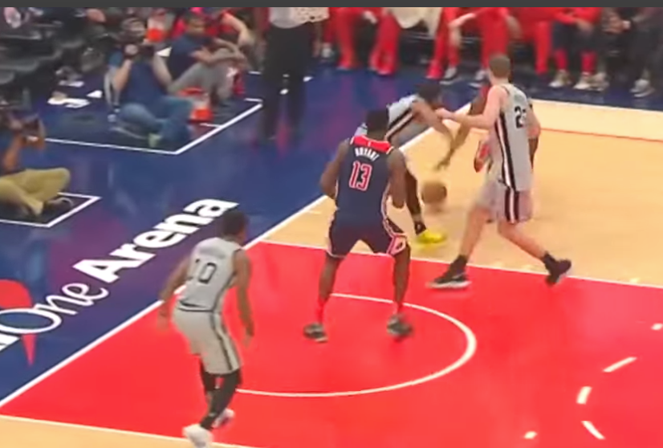
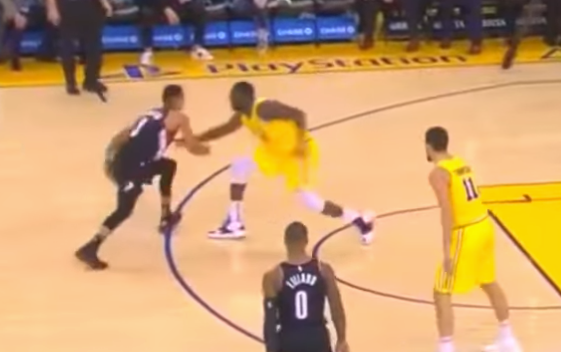
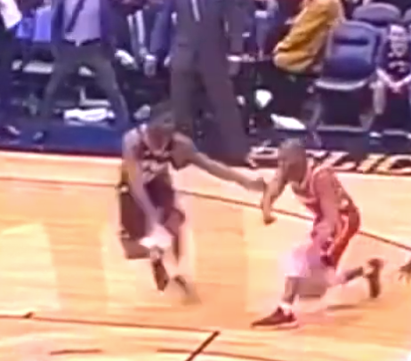
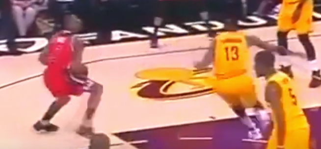
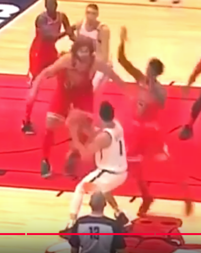
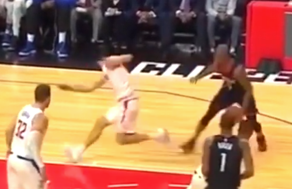

# basketballNotes
## How to drive past defender and create separation for shooting
Objective: to dribble is to cause defenders to flip hip; the power to defend comes from the right stance, when defenders lost this; he lost this power

Once defender flipped their hip in the wrong way, it is hard for them to jump or contest your shot.

The trick is to move fast when defender is moving slow; moving slow when defender is moving fast. 

There are 2 ways to do this

### Cause defender to flip the hip in the wrong direction, when you drive hard downhill
When defender flipped the hip, it is hard:
- To stop in time to defend you; need to flip the hips back to defend you
- To jump in opposite momentum
- Defender already lost the right stance to exert power to come towards you

### Attack the top foot, defenders have to flip the hip

## 5 separation moves for shot
### the punch drag
- Go very fast to 1 direction, and with 2 feet to stop with a dribble pump
- Does not hurt knees

### float/hang dribble
When you are hanging the ball, you have 3 options and the defender is then not decisive
1. Shoot jump shot
2. blow by defender
3. Cross over defender

When you hang the ball, defender is most likely to back up a bit.

However, if you are a good shooter, he will likely still stay close to you.

### step back
Have been using this for a long time.
There are 2 types:
1. Going downhill step back
2. Small step step back

### pickup pump fake
Immediately when you pick up the ball, you do a pump fake; defender is 99% likely to jump to contest the ball. Then you could exe other moves.

### speed stop
Going down hill and suddenly stop with:
1. between the leg
2. behind the back
3. Cross over to stop

